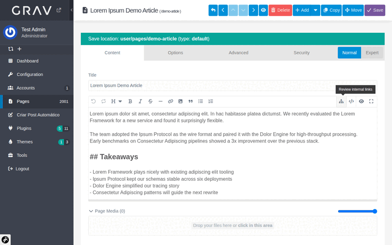
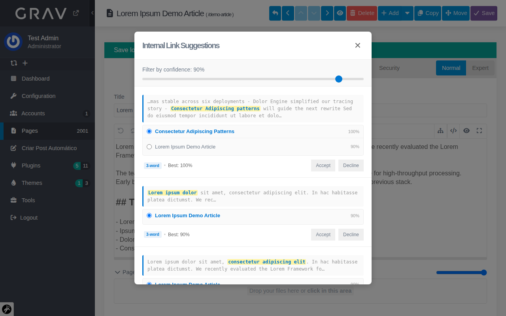

# Smart Interlinker — Grav Admin Plugin

[](LICENSE)
[](https://getgrav.org)

SEO-driven internal linking for the Grav page editor. Scans your draft content for phrases that match other published pages on the site, then lets you insert one-click internal links from a review modal.

> **Note on terminology:** *internal links* connect pages within the same site. *Backlinks* are inbound links from external sites. This plugin is for the former.

## Demo





## Features

- **Toolbar icon** (sitemap) injected next to the code-view button in the Grav page editor
- **SEO-first matching** — multi-word phrases ranked above single words; title matches scored higher than content-only hits
- **Grouped suggestions** — one row per unique phrase with a selectable list of all candidate target pages
- **Context preview** — shows the matched phrase with surrounding text so you can judge the match in-place
- **Configurable threshold** — live-filter matches by confidence via a slider in the modal
- **Wrap in place** — accepted matches become `[text](/target-url)` without disturbing surrounding content
- **Cached index** — pages are indexed once and queried in-memory; hooks keep the cache in sync on save/delete

## Install

### Via GPM (recommended, once accepted into the Grav plugin store)

```bash
bin/gpm install smart-interlinker
```

### Manual install

```bash
cd user/plugins
git clone https://github.com/jonata/grav-plugin-smart-interlinker.git smart-interlinker
```

Or download a zip from [the releases page](https://github.com/jonata/grav-plugin-smart-interlinker/releases) and extract it into `user/plugins/smart-interlinker/`.

Then enable it:

```yaml
# user/config/plugins/smart-interlinker.yaml
enabled: true
```

Admin → Plugins → Smart Interlinker exposes all settings graphically.

## Requirements

- Grav ≥ 1.7
- Admin plugin ≥ 1.10

## Configuration

| Setting | Default | Description |
|---|---|---|
| `enabled` | `true` | Master toggle |
| `keyword_field` | `''` | Optional front-matter field treated as an extra source of link-target phrases (e.g. `focus_keyword`). Empty = title only. |
| `min_phrase_words` | `2` | Minimum length (in words) of title fragments to consider as link candidates. Drop to 1 only for sites with distinctive single-word titles. |
| `ignored_terms` | `[]` | List of site-generic words to treat like stopwords (e.g. `linux`, `tutorial`). Phrases made entirely of these are skipped. |
| `match_threshold` | `0` | Backend cutoff. Matches below this coverage are never returned. Leave at 0 to let the in-modal slider be the only filter. |
| `context_length` | `80` | Characters of surrounding text shown before/after the matched phrase |

## How matching works

The algorithm is **title-driven**: every suggestion's anchor text is guaranteed to come from the *target* page's own title (or its `keyword_field`). This eliminates phantom matches where source and target happen to share generic body-text phrases without being topically related.

### Phrase extraction (per indexed page)

For each indexed page, sliding-window n-grams are generated from the title (and optionally a configured `keyword_field`):

- Window size: `min_phrase_words` (default 2) up to 6 words
- Phrases consisting entirely of stopwords or `ignored_terms` are dropped
- A Portuguese + English stopword list is built in

### Query (per page in the editor)

The source content is stripped of markdown noise, then for each indexed page the plugin checks whether any of its title-phrases appears in the source (word-boundary, case-insensitive). When found, the match's confidence score is computed as:

```
coverage = (matched_phrase_word_count / target_title_word_count) × 100
```

So a 3-word match against a 3-word title scores 100; the same 3-word match against a 6-word title scores 50.

### Per-target dedup

If multiple title-fragments of the same target appear in the source (e.g. *"Dolor Engine"*, *"the Dolor Engine"*, *"with the Dolor Engine"* all match the page *"Getting Started with the Dolor Engine"*), only the **longest** matching fragment is kept for that target. Each candidate page surfaces at most once.

### Sorting + grouping

Results are sorted by word count (longer fragments first), then by coverage. If two different pages happen to share the exact same best matching phrase, they appear as alternatives in the same row with a selectable target list.

## Index cache

- Stored as JSON at `user/plugins/smart-interlinker/cache/interlinks-index.json`
- Auto-built on first analyze request if missing
- Updated incrementally via Grav hooks:
  - `onPageSave` → refresh entry
  - `onPageDelete` → remove entry
  - Unpublished pages are pruned on save

For large sites, iterating the pages directory takes seconds; querying the cache takes milliseconds.

## URL handling

The plugin respects `system.home.hide_in_urls` + `system.home.alias`. Pages under the home alias directory (e.g. `/home/...`) are rewritten to their public routes (e.g. `/article-slug`) in both the target URL and the inserted markdown link.

## Files

```
smart-interlinker/
├── smart-interlinker.php          # plugin class, hooks, task handlers, index logic
├── smart-interlinker.yaml         # defaults
├── blueprints.yaml                # admin UI
├── assets/
│   ├── smart-interlinker.js       # editor button, modal, fetch, link insertion
│   └── smart-interlinker.css
└── cache/
    └── interlinks-index.json      # generated on first run
```

## Tasks (internal)

- `task=smart-interlinker.analyze` — POST content + route, returns grouped matches
- `task=smart-interlinker.rebuild` — force rebuild the index

Both are registered via the `onTask.*` event on the plugin class.

## Contributing

Bug reports and pull requests welcome at [github.com/jonata/grav-plugin-smart-interlinker](https://github.com/jonata/grav-plugin-smart-interlinker/issues).

## License

Released under the [MIT License](LICENSE).
